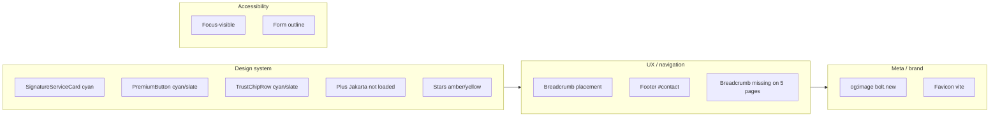

# Full Visual Audit – TRC Roofing Site

## 1. Design system consistency

The site defines a clear palette in [src/index.css](src/index.css): slate-blue accent (`--color-accent: #5b7c99`), copper highlights, DM Sans + Instrument Serif, and luxury card/button utilities. Several components break this.

### 1.1 Accent and font drift

| Location                                                            | Issue                                                                                                        | Recommendation                                                                                                                                                                     |
| ------------------------------------------------------------------- | ------------------------------------------------------------------------------------------------------------ | ---------------------------------------------------------------------------------------------------------------------------------------------------------------------------------- |
| [SignatureServiceCard.tsx](src/components/SignatureServiceCard.tsx) | Uses **cyan/teal** `rgba(6, 182, 212, ...)` for icon bg and glow; **Plus Jakarta Sans** for number and title | Use `var(--color-accent)`, `var(--color-accent-glow)`, and `font-family: 'DM Sans'` / Instrument Serif for headings                                                                |
| [PremiumButton.tsx](src/components/PremiumButton.tsx)               | **Cyan** gradients (`from-cyan-500`, `shadow-cyan-500/25`) and **slate** secondary; used in Footer           | Rebuild variants using CSS variables (e.g. `.btn-primary` / `.btn-secondary` from index.css) or inline styles with `var(--color-accent)` so footer CTAs match the rest of the site |
| [TrustChipRow.tsx](src/components/TrustChipRow.tsx)                 | Light variant: `border-cyan-200/50 text-slate-700`                                                           | Use design tokens: e.g. `var(--color-border-medium)`, `var(--color-text-primary)` or `--color-text-secondary`                                                                      |

### 1.2 Typography

**Plus Jakarta Sans** is referenced in multiple components but **not loaded** in [index.html](index.html) or [index.css](src/index.css) (only DM Sans and Instrument Serif are). Browsers fall back to generic sans-serif, which can look inconsistent.

- **Affected:** [SignatureServiceCard.tsx](src/components/SignatureServiceCard.tsx), [StatCard.tsx](src/components/StatCard.tsx), [ServiceCard.tsx](src/components/ServiceCard.tsx), [PremiumValueCard.tsx](src/components/PremiumValueCard.tsx), [ImpactBlock.tsx](src/components/ImpactBlock.tsx), [FAQItem.tsx](src/components/FAQItem.tsx), [CTASection.tsx](src/components/CTASection.tsx), [Locations.tsx](src/pages/Locations.tsx)
- **Options:** (A) Add Plus Jakarta Sans to the font stack and load it, or (B) Replace all Plus Jakarta Sans with `'DM Sans', sans-serif` (and Instrument Serif for headings) for a single, already-loaded system.

### 1.3 Star / rating colour

- [Reviews.tsx](src/pages/Reviews.tsx): stars use `fill-amber-400` / `text-gray-600`.
- [PremiumReviewCard.tsx](src/components/PremiumReviewCard.tsx): stars use `fill-yellow-400` / `fill-gray-300`.

For a cohesive look, use the design system accent for filled stars (e.g. `var(--color-accent)` or a dedicated star variable) and a muted neutral for empty; alternatively keep amber/yellow only if you explicitly want “rating” to stand out from the main accent.

### 1.4 Unused / off-palette animation

In [index.css](src/index.css), `@keyframes subtle-glow` uses `rgba(37, 99, 235)` (blue) instead of the slate-blue accent. If this animation is used, switch to `var(--color-accent-glow)` or the same rgba as the accent for consistency.

---

## 2. Breadcrumb placement and coverage

- **Contact** and **About** render [Breadcrumb](src/components/Breadcrumb.tsx) **inside** [PageHero](src/components/PageHero.tsx) as children (below subtitle). Breadcrumbs are typically at the **top** of the content area so they’re seen first.
- **ServiceDetail** correctly places the breadcrumb in the first content section below the hero.
- **Services, Gallery, Areas, Process, Reviews** do not show breadcrumbs, which is inconsistent for a multi-page site.

**Suggestions:**

- Move breadcrumbs out of the hero: either above the hero (e.g. in a thin bar) or at the top of the first content section, and use the same pattern on Contact and About as on ServiceDetail.
- Add breadcrumbs to Services, Gallery, Areas, Process, and Reviews with a shared pattern (e.g. Home > [Section] > [Optional subpage]).

---

## 3. Footer CTA and anchor

- In [Footer.tsx](src/components/Footer.tsx), “Get Quote” uses `href="#contact"` (lines 154 and 213). The [Contact](src/pages/Contact.tsx) page does **not** define `id="contact"` on the form or section, so the anchor does nothing (and from other pages you’d still need to navigate to Contact first).
- **Fix:** Use `href="/contact"` for “Get Quote” (and use React Router’s `Link` with `to="/contact"` if you want SPA navigation), or add `id="contact"` to the main form section on the Contact page and use `href="/contact#contact"` only when linking from outside Contact.

Other components that default to `#contact` ([CinematicCTA](src/components/CinematicCTA.tsx), [ServiceCTABar](src/components/ServiceCTABar.tsx), [HeroCTA](src/components/HeroCTA.tsx), [DecisionPointCTA](src/components/DecisionPointCTA.tsx), [ContactCTAPanel](src/components/ContactCTAPanel.tsx)) are already overridden by config to use `/contact` where used; ensure any remaining usages point to `/contact` or `/contact#contact` if you add the id.

---

## 4. Meta and favicon

In [index.html](index.html):

- **og:image** and **twitter:image** point to `https://bolt.new/static/og_default.png`. Replace with a site-specific image (e.g. logo or hero) for correct previews when shared.
- **Favicon** is `/vite.svg`. Replace with a TRC Roofing favicon (e.g. “T” or logo mark) for branding.

---

## 5. Accessibility (focus and form)

- Form inputs in [index.css](src/index.css) use `outline: none` with a focus `box-shadow` (e.g. `0 0 0 3px rgba(91, 124, 153, 0.2)`). That’s acceptable if the ring is clearly visible; ensure there is no dependency on colour alone and that focus is visible in high-contrast scenarios.
- Buttons and links across the site rarely define explicit `:focus-visible` styles. Adding a consistent focus-visible ring (e.g. using the same accent glow or a 2px outline) to `.btn-primary`, `.btn-secondary`, and key links (e.g. in Header/Footer) would improve keyboard usability.

---

## 6. Small copy and config fixes

- **Config:** [config.ts](src/config.ts) has `email: 'enquires@trcroofing.co.uk'`. If the intended word is “enquiries”, update to `enquiries@...`.
- **Contact page:** The optional “Upload photos” control is a non-functional div styled like an input. Either implement file input and upload or replace with a short line of copy (e.g. “You can attach photos when we reply”) so users don’t expect uploads to work.

---

## 7. Optional visual polish

- **Hero spacing:** Home hero uses inline `paddingTop: '11rem', paddingBottom: '8rem'`. Consider moving these to CSS variables (e.g. `--hero-padding-`*) so they’re consistent and easier to tune.
- **Section alternation:** Section backgrounds already alternate (`var(--color-bg-base)` / `var(--color-bg-surface)`). Keeping this pattern on new pages will preserve rhythm.
- **Empty states:** Gallery and Reviews handle “no content” with placeholders and copy; this is clear. If you add more list or grid pages, reusing similar empty-state patterns will keep the experience consistent.

---

## Summary diagram (findings by area)

---

## Suggested implementation order

1. **High impact, low effort:** Fix footer “Get Quote” link (`/contact` or add `id="contact"` and use consistently). Align PremiumButton and TrustChipRow with design tokens so the footer and trust chips match the rest of the site.
2. **Design system:** Replace cyan/teal and Plus Jakarta in SignatureServiceCard (and optionally other cards) with accent colour and DM Sans/Instrument Serif; optionally unify star colours with the palette.
3. **Breadcrumbs:** Standardise placement (e.g. top of first content section) and add breadcrumbs to Services, Gallery, Areas, Process, Reviews.
4. **Meta and favicon:** Replace og:image, twitter:image, and favicon with TRC-specific assets.
5. **Accessibility:** Add focus-visible styles to primary buttons and main nav links; keep form focus ring and ensure visibility.
6. **Copy and behaviour:** Fix email typo if desired; clarify or implement the Contact “upload photos” behaviour.

This order addresses the most visible inconsistencies first (footer and service cards), then navigation and discovery (breadcrumbs), then branding and accessibility.